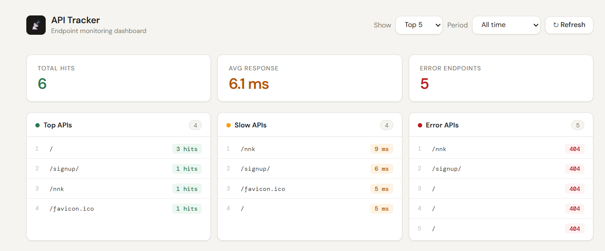
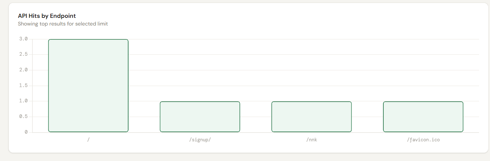
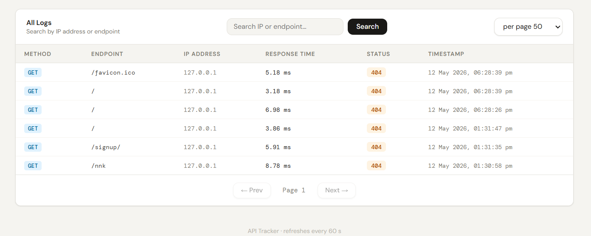

🚀 API Tracker (Django)

A reusable Django package to track API usage, monitor performance, and visualize logs with a dashboard.

---

✨ Features

- 📊 API request logging (path, method, status)
- ⚡ Response time tracking
- 🌐 IP address logging
- 🧹 Auto cleanup (delete old logs)
- 🔐 Admin/Staff-only dashboard
- ⚙️ Configurable settings (Retention days, ignore paths)

---

📦 Installation

pip install api-tracker

---

⚙️ Setup

1. Add to INSTALLED_APPS

'api_tracker',

---

2. Add Middleware

MIDDLEWARE = [
    'api_tracker.middleware.APILoggingMiddleware',
]

---

3. Run migrations

python manage.py migrate

---

4. Optional Settings

API_TRACKER = {
    "RETENTION_DAYS": 7,
    "IGNORE_PATHS": ["/admin/", "/api-tracker/","/alllogs/"]
}

---

🧹 Cleanup Logs

Delete old logs manually:

python manage.py cleanup_logs --days=7

Or use default retention:

python manage.py cleanup_logs

---

📊 Dashboard

Access dashboard at:

/api-tracker/dashboard/

👉 Only accessible by Admin/Staff users

---

🖼️ Screenshots

## 🏠 Dashboard 

## Graphs

## Logs

---

💡 Use Cases

- Monitor API performance
- Track user activity
- Debug slow endpoints
- Maintain clean database

---

🛠️ Tech Stack

- Django
- Python
---

👨‍💻 Author

Pulkit

---

⭐ Contribute

Feel free to fork and improve this project!